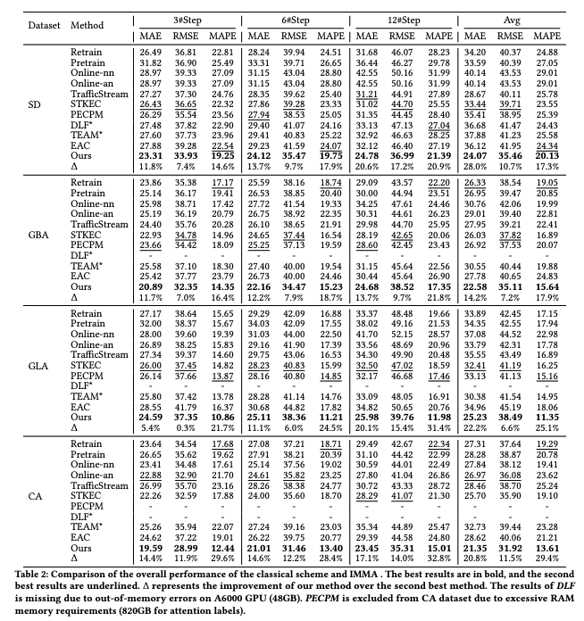
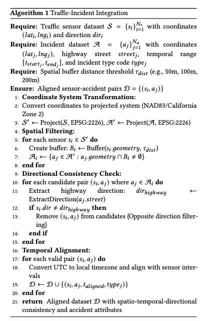

# IMMA: Incident-aware Momentum and Memory Adaptation on Streaming Traffic Data under Compound Drift

**Official Implementation**

## Abstract

Supporting intelligent decision-making and efficient management in growing and digitalized cities relies on the continuous collection and analysis of diverse data. Such streaming data provides the foundation for proactive management, such as forecasting traffic flow, which is crucial for optimizing traffic scheduling and preventing congestions.
A critical challenge in traffic forecasting is intricate changes in the underlying distribution of streaming data over time, which is known as concept drift. While adept at capturing spatio-temporal dynamics and adapting to graph evolution, conventional models are inefficient against concept drift as their failure to distinguish multi-scale drift changes necessitates costly cycles of knowledge-replay or retraining whenever a drift occurs, even a minor incident. We introduce the concept of **Compound Drift** by subdividing the periods of drift occurrences, highlighting that both short-term changes and long-term shifts can coexist in the data distribution. Furthermore, we identify the intrinsic connection between report-based incident tags and short-term drift, and propose an efficient adaptive framework, **Incident-aware Momentum and Memory Adaption (IMMA)**, designed to manage compound drift. IMMA incorporates an **Incident-aware Momentum Update (IMU)** mechanism, which adaptively updates the momentum model's parameters under the guidance of incident information and uses pseudo-targets generated by the momentum model as additional supervision to enable rapid response and recovery from short-term transient incident, and a **Memory-Augmented Embedding Generator (MEG)** to generate input-specific meta-init embeddings to adapt to long-term evolution. Extensive experiments on four large-scale real-world traffic datasets demonstrate that IMMA achieves strong adaptability to compound drift while maintaining high efficiency.

---

## 📊 Main Architecture



---

## 📁 Data Processing

### Event-Sensor Data Alignment
To obtain the code for matching event data with sensor data, refer to `Data_alignment_SD/Data_alignment.ipynb`. The code logic is as follows:
We provide a notebook with run results in Data_alignment_SD and Data_alignment_PEMS03


### Event-Stream Data Alignment
To obtain the code for matching event data with stream data, refer to `Data_alignment_SD/Data_to_Stream.ipynb`.

> **TODO**: Direct access to processed complete data - download from this link

---

## 📋 Logs and Weights

IMMA and baseline models are implemented based on the TrafficStream pipeline. The only difference is that the code for selecting only one month per year has been removed in `IMMA/utils/data_convert.py`.

Log files and weight files can be obtained from:
- **IMMA results**: `IMMA/res/`
- **Baseline model results**: `Online_Baselines/log/`

---

## 🚀 Getting Started

### Running IMMA

To run IMMA directly:
```bash
python IMMA/main.py 
```

To run any variant of IMMA, modify the configuration in the `conf` directory.

### Memory-Efficient Version

Since our server has 768GB RAM, we provide a memory-efficient version of IMMA (which may take more time to run):
```bash
python IMMA/main_mem.py 
```

### Running Baseline Models

To run baseline models (except STKEC and PECPM):
```bash
python Online_Baselines/main.py 
```

### Running PECPM and STKEC

Generate additional attention labels as supervision for PECPM:
```bash
python Online_Baselines/compute_attn.py
```

Run PECPM and STKEC models:
```bash
python Online_Baselines/pecpm_main.py
python Online_Baselines/stkec_main.py
```

---

## 🙏 Acknowledgments

We thank the following repositories for their helpful contributions:

- [EAC](https://github.com/Onedean/EAC)
- [STKEC](https://github.com/UnderReview24/STKEC/)
- [PECPM](https://github.com/wangbinwu13116175205/PECPM)
- [DLF](https://github.com/wangbinwu13116175205/DLF)
- [TEAM](https://github.com/kvmduc/TEAM-topo-evo-traffic-forecasting)
- [TrafficStream](https://github.com/AprLie/TrafficStream/)

